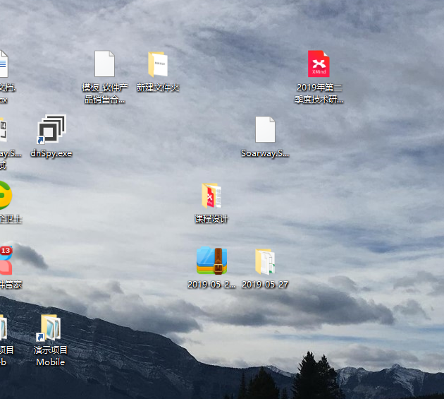

# 一级标题
## 二级标题
### 三级标题

一共有6级标题

###### 六级标题

推荐用Vs Code

插入代码

```csharp
Console.WriteLine("Hello World");
```

```csharp
public PageResult<K> ToPageResult<K>(int num, int size, Expression<Func<T, bool>> clause)
{
    if (num <= 0)
        throw new Exception("分页接口的当前页码应为大于1的整数。");
    if (size <= 0 && size >= 500)
        throw new Exception("分页接口的当前页码应为大于1小于500的整数。");
    var result = Entities.Where(clause).Skip((num - 1) * size).Take(size).ToList();
    var count = Entities.Count(clause);
    PageResult<K> output = new PageResult<K>();
    output.page.Update(num, size, count);
    output.result = Mapper.Map<List<T>, List<K>>(result);
    return output;
}
```

系统配置节点
```javascript
{
    baseUrl:"http//localhost:5100"    
}
```

```xml
<xml>
    <data>Hello World</data>
</xml>
```

*这是斜体*

**这是粗体**

***粗体加斜体***

选择 **Visual C#**


1. 第一节
2. 第二节
3. 第三节
   >注意：对象不要空引用
    >>1111


[这是百度的网址](http://www.baidu.com)


(grammar 语法) 从句；分句；子句 
a group of words that `includes a subject and a verb`, and forms a sentence or part of a sentence


查看图片

