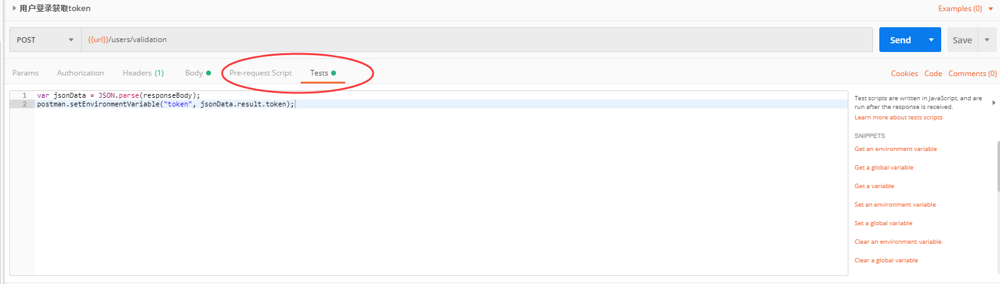
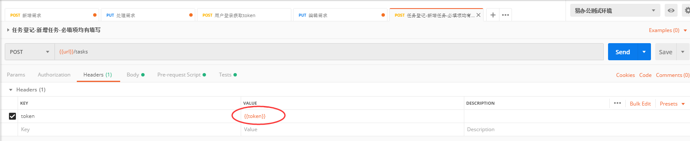
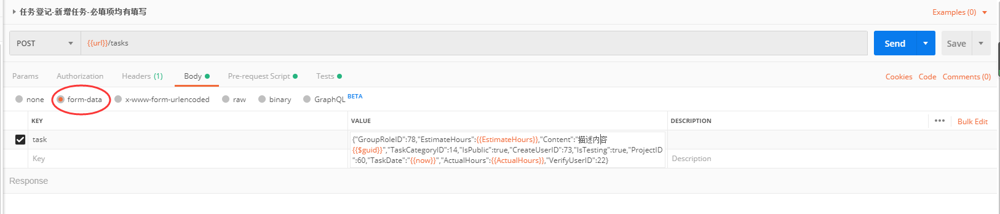

### POSTMAN 脚本使用总结：
在postman中脚本编辑主要在pre-request script以及tests中：


###  pre-request script中的脚本
在pre-request script中：主要写一些获取变量、清除变量、设置变量等语句，用于后面需要请求中需要用到的变量在这里做好前置定义
#### 常用代码：
```javascript
pm.globals.unset("variable_key"); // 清除全局变量
pm.environment.unset("variable_key"); // 清除环境变量
pm.globals.get("variable_key");     // 获取全局变量
pm.variables.get("variable_key");   // 获取一个变量
pm.environment.get("variable_key");   //   获取环境变量
pm.sendRequest("https://postman-echo.com/get", function (err, response){console.log(response.json());}); 发送一个请求
pm.globals.set("variable_key", "variable_value");  设置环境变量  

// 获取上一次的变量信息，并在原基础上使变量+1在设置为环境变量的值

// 生成当前时间
var date = new  Date();
var createdate = date.getFullYear() + "-" + (date.getMonth()+1) + "-" + date.getDate() + " " + date.getHours()+":"+date.getMinutes()+":"+date.getSeconds();

// 生成随机数：
postman.setEnvironmentVariable("VerifyHours", Math.round(Math.random()*9));  // 生成随机的数字并复制给变量VerifyHours
postman.setEnvironmentVariable("content", ("0000" + (Math.random()*Math.pow(36,4) << 0).toString(36)).slice(-4));

const randomInt = (min, max) => Math.floor(Math.random() * (max - min + 1)) + min;  // 随机整数
const getRandomValue = list => list[randomInt(0, list.length - 1)];  // 随机选项
environment.randomMobile = `18${randomInt(100000000, 999999999)}`;// 随机手机
environment.randomDevice = getRandomValue(['ios', 'android']);// 随机设备名

{{$guid}}：添加一个V4风格GUID(如： aa002-44ac-45ca-aae3-52bf19650e2d)
{{$timestamp}}：将当前的时间戳，精确到秒
{{$randomInt}}：添加0和1000之间的随机整数
```


### Tests中的脚本：
#### 1、主要写一些断言用来辅助验证返回值是否正常如：
```javascript
pm.test("响应时间小于500ms", function () {pm.expect(pm.response.responseTime).to.be.below(500);});  //验证响应时间是否小于500ms
pm.test("接口调用成功", function () {pm.expect(pm.response.code).to.be.oneOf([200]);});var jsonData = JSON.parse(responseBody); //验证接口是否能够调通
tests[`isSucess返回结果为: ${jsonData.status.isSuccess}`] = jsonData.status.isSuccess === true; //验证返回结果是否成功
```
#### 2、也可去定义下一执行的接口名称：
```javascript
postman.setNextRequest("填写你要跳转的接口名")
```
#####  只有在collection runner或Newman里才生效（在普通界面你选哪个发送就是哪个）
 假设2个用例的顺序为： 用例A 用例B 如果希望执行顺序为： 用例A -> 用例B -> 用例A，又不想复制一份用例A，那么用例A的Tests里写 if (xxx) postman.setNextRequest('null'); 终止执行。 用例B的Tests里写 postman.setNextRequest('用例A'); 【注意】如果不设终止条件，用例A执行完到用例B，用例B执行完又指向用例A，会构成死循环
#### 3、增加判断语句去控制是否执行验证：
```javascript
var jsonData = JSON.parse(responseBody);

if (jsonData.status.actionMsg.msg === "当前接口禁止匿名调用。")
  {
      postman.setNextRequest("用户登录获取token");
  }
else
 {
     postman.setEnvironmentVariable("TaskID", jsonData.result.TaskID); 
     postman.setEnvironmentVariable("TaskID_R", jsonData.result.TaskID);
     tests[`TaskID为：${jsonData.result.TaskID}`] = jsonData.result.TaskID !== 0;
     postman.setNextRequest("任务登记-编辑任务");
 }
```


### 实例：
#### 任务登记的接口：
#### 场景：新增任务→编辑任务→完成任务→任务审核
①新增任务：新增任务不能匿名调用接口，因此需要先执行用户登录接口，并获取用户的token生成变量名
 ```javascript
  // 新增任务接口中的判断
 if (jsonData.status.actionMsg.msg === "当前接口禁止匿名调用。")
  {
      postman.setNextRequest("用户登录获取token");
  }
  // 用户登录接口中获取token并生成变量以便后续接口调用
  var jsonData = JSON.parse(responseBody);
postman.setEnvironmentVariable("token", jsonData.result.token);
```

②在新增登录接口 ——headers增加token并且值为引用前面生成的变量：以“{{token}}”形式调用


③为了时创建时间不一样这里在pre-request script中定义的获取时间的变量以便在body中调用
```javascript 
var date = new  Date();
var createdate = date.getFullYear() + "-" + (date.getMonth()+1) + "-" + date.getDate() + " " + date.getHours()+":"+date.getMinutes()+":"+date.getSeconds();
postman.setEnvironmentVariable("now", createdate);
```

④在body中填写要发送的参数体，因为该接口有附件所以此处选择“formdata”，参数中部分为有引用变量部分为固定值：

⑤在tests中增加一些断言：
```javascript
var jsonData = JSON.parse(responseBody);

if (jsonData.status.actionMsg.msg === "当前接口禁止匿名调用。")
  {
      postman.setNextRequest("用户登录获取token");
  } // 若返回结果为当前接口禁止匿名调用则下一接口发送用户登录请求获取token
else
 {
     pm.test("相应时间小于500ms", function () {
    pm.expect(pm.response.responseTime).to.be.below(500);
}); //接口的相应时间应小于500ms，并返回实际相应时间
pm.test("接口调用成功", function () {
    pm.expect(pm.response.code).to.be.oneOf([200]);
}); //验证接口是否调用成功
var jsonData = JSON.parse(responseBody);
tests[`isSucess返回结果为: ${jsonData.status.isSuccess}`] = jsonData.status.isSuccess === true; //验证接口是否调用成功
     postman.setEnvironmentVariable("TaskID", 
     tests[`TaskID为：${jsonData.result.TaskID}`] = jsonData.result.TaskID !== 0;  //taskid应不为0，且返回实际生成的id值
     jsonData.result.TaskID); // 将返回的taskid设为变量以便后续接口调用
     
     
     postman.setNextRequest("任务登记-编辑任务");// 指定下一发送接口名称
 }
 ```
 ⑥继续完成编辑、完成、审核任务的脚本编写并放在同一个collection中。再RUNNER中指定该collection及需调用的环境变量即可跑完一个流程
 
