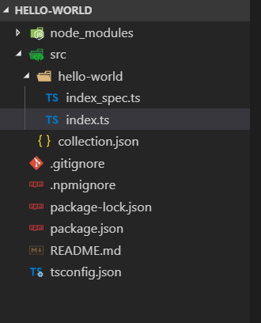

# Angular脚手架 （一） (v1.0)

在Angular项目中我们有用到过`ng add`这种命令，例如`ng add ng-alain`，这个命令可以帮我们下载各种依赖包和生成目录结构。这次我们就简单讲一下要如何实现。

### 一、创建schematics及简单介绍
 脚手架部分完全基于 Schematics 部分进行开发。官方翻译是[原理图](https://angular.cn/guide/schematics)。

 首先我们先安装schematics cli

 ``` 
 npm install -g @angular-devkit/schematics-cli
 ```
 安装好之后创建一个新的schematics
 ```
 schematics blank --name=hello-world
 ```
 然后
 ```
 cd hello-world
 code .
 ```
 启动项目后，我们可以看到生成如下目录：

  

 其中的`index.ts`是入口文件,内部有一个helloWorld函数，这是入口函数，其对应的是`collection.json`里的一个Key。`collection.json`是所有schematics的集合。

  
 

 `index.ts`里的helloWorld方法中，有几个类型，务必**要熟知**，清楚这些概念其实就很好学习schematics了，以下[复制于官网](https://angular.cn/guide/schematics-authoring#schematics-concepts)：
 
 * Tree（树）：虚拟文件系统用 Tree（树）表示。Tree 数据结构包含一个基础状态 base（一组已经存在的文件）和一个 暂存区 staging（需要应用到 base 的更改列表）。在进行修改的过程中，你并没有真正改变它的 base，而是把那些修改添加到了暂存区。

 * Rule（规则）：对象定义了一个函数，它接受 Tree，进行变换，并返回一个新的 Tree 。原理图的主文件 index.ts 定义了一组实现原理图逻辑的规则。

 * 变换由 Action（动作）表示。有四种动作类型：Create、Rename、Overwrite 和 Delete 。（这个我猜是tree里的四个方法...）

 * SchematicContext：每个原理图都在一个上下文中运行，上下文由一个 SchematicContext 对象表示。

 ### 二、创建可供ng add使用的schematics

 为了让我们可以使用`ng add hello-world`，我们首先要把src下的hello-world文件夹改成`ng-add`，同时别忘了把`collection.json`里也要做相应的修改：
 

 然后在`index.ts`里的helloWorld里写点什么，例如`console.log('hi')`,
 或者使用`_context.logger`这个可以自己去玩玩，在此不赘述
 

 然后我们执行以下命令：
 ```
 npm run build
 ```
 可以看到模板编译生成了js文件

 

 执行命令：

 ```
 schematics .:ng-add // 测试命令
 ```
 然后就可以看输出了Hi

 

 三、发布
 我们可以利用npm快速进行发布，执行以下命令：

 ```
 npm run build // 注意！发布前要记得build一下

 npm publish
 ```

 ### 四、结尾
 这篇属于入门内容，先了解这些后面更好深入，后续会补充完善更多内容。文字一下子不好组织...