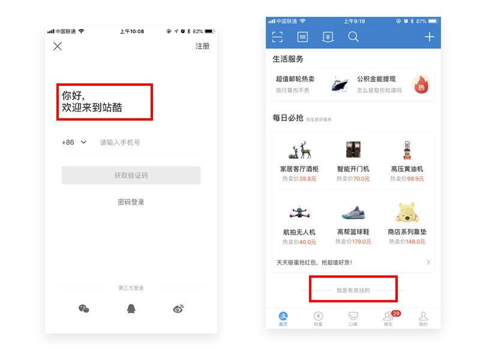
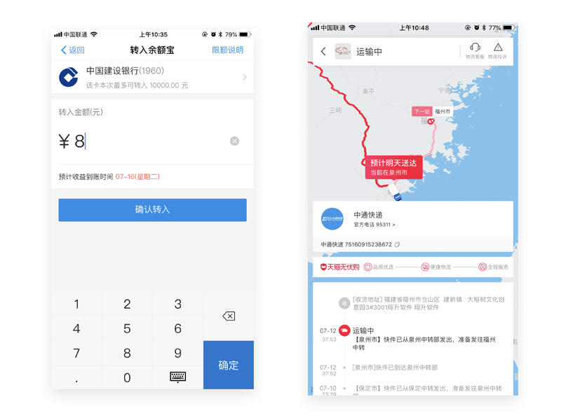
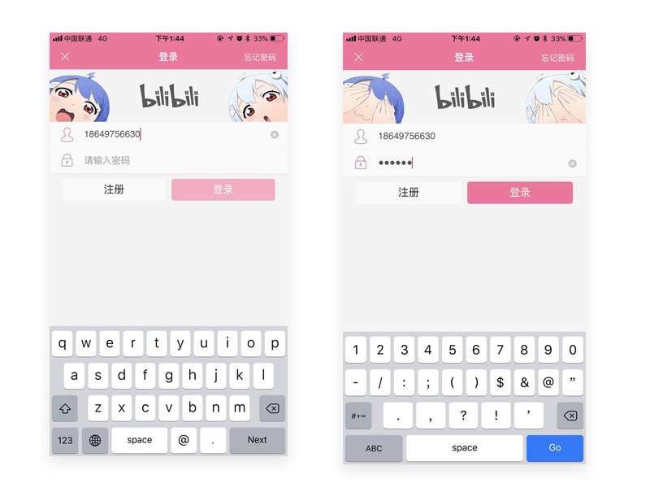
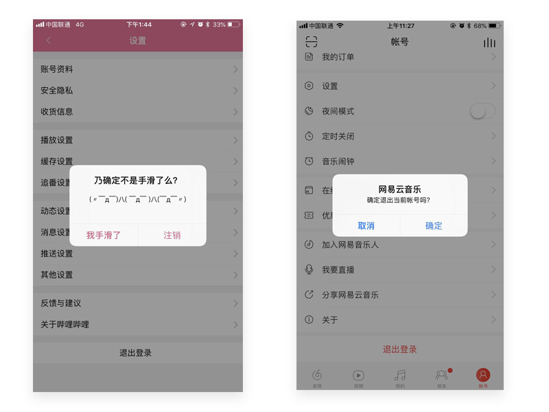

# UI设计里的情感化设计    

基于唐纳德·A·诺曼《设计心理学3-情感化设计》及日常的玩APP的个人体验做简易分享。

## 一、什么是情感化设计
情感情感是态度这一整体中的一部分，它与态度中的内向感受、意向具有协调一致性，是人对外界事物作用于自身时的一种生理反应，是由需求和期望决定的。当这种需求和期望得到满足时会产生愉悦、喜爱的情感，（比如客户觉得翔升服务很好）。反之，在得不到满足时会散发苦恼、厌恶的情绪（比如客户反馈产品功能隐藏太深）。

情感化设计是基于满足产品的功能、了解业务逻辑的前提下，设计出既不影响产品功能且符合业务逻辑又能满足用户更高层级的需求和期望的一种创意设计。

## 二、情感化设计的目的
1.赋予产品情感，增加用户粘性；

2.树立品牌形象，增强用户认知；

3.引导用户操作，达成设计目的。

## 三、话不多说，直接上车
#### 1.交互层次的情感设计
 
情感来源于交流，人与人之间需要通过沟通交流增强情感联系，人与产品之间一样需要。而产品与用户交流的最好方式就是反馈，因此在交互设计中，要时刻对用户做出的操作进行反馈。比如：站酷在登录页的拟人语气，支付宝下拉到底部出现“我是有底线的”幽默方式，一下子拉近了与用户的距离。

#### 2.符合预期与超出预期的设计
 
设计应符合常识性的预期结果，比如点击开机键就是启动设备，直观明了。所以在交互设计时，用户做出某项常规操作会产生什么样的结果，应该预先告知用户可能的结果，这样有利于增加用户的信任感。（这一点可以广泛应用到我司产品）比如转入余额宝的收益到账和天猫的包裹到达时间。而如果能在满足用户预期的前提下，增加一些正向的出乎意料的反馈，则会大大地引发用户的好奇心和探索欲望。比如UC浏览器对文章点赞时的提醒。

#### 3.趣味的拟人动作设计
 
我们都知道密码是私密信息，在使用哔哩哔哩APP登录输入密码时，22和33（B站的IP形象的名称）会把眼睛捂起来。不仅给用户一种安全感，而且会对这拟人化的动作感到十分有趣，赋予产品如同真人一般的情感。

#### 4.允许犯错的设计

用户会因为一些客观或主观的因素，导致产品不能正常使用或错误使用。这是必然会出现的现象，而且无法完全避免，因此在设计时就应该预知到会出现哪些情况并制定相对应的应对措施。例如，用户在做一些敏感操作，比如退出登录时，会再次提醒用户是否确认退出，并说明退出后可能会有的情况。
