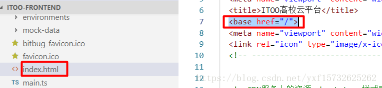

# Angular之ng build部署后base文件路径问题 #

## 1、问题描述 ##

   使用angular-cli搭建的项目，执行**ng build --prod** 后，部署成子站点（添加应用程序）浏览器打开空白，界面显示一直loading.提示找不到相关的JS文件，路径变成根目录。

## 2、问题定位 ##

   文件路径不对，使用ng new project搭建后，在宿主页面默认设置了一个基本路径：

   


## 3、解决方案 ##
   
   >生产环境构建：ng build --prod --base-href ./


# angular应用部署在iis上，刷新出现404 #

## 解决方案 ##

安装 iis [URL Rewrite](https://www.microsoft.com/en-us/download/details.aspx?id=47337) 模块,并在 src 目录下增加web.config，配置urlrewrite如下：
```csharp
<configuration>
<system.webServer>
  <rewrite>
    <rules>
      <rule name="Angular Routes" stopProcessing="true">
        <match url=".*" />
      <conditions logicalGrouping="MatchAll">
        <add input="{REQUEST_FILENAME}" matchType="IsFile" negate="true" />
        <add input="{REQUEST_FILENAME}" matchType="IsDirectory" negate="true" />
      </conditions>
      <action type="Rewrite" url="/" />
      </rule>
    </rules>
  </rewrite>
</system.webServer>
</configuration>
```
配置 web.config 自动打包

修改 angular.json 

```csharp
 “build”: {
       "options”: {
         . . . 
         "assets": [
            “src/assets”,
            “src/favicon.ico”,
            “src/web.config”
             ],
```