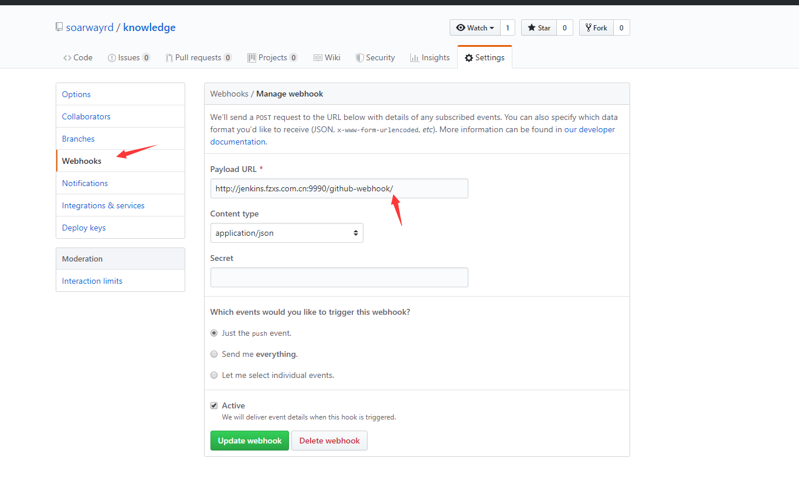
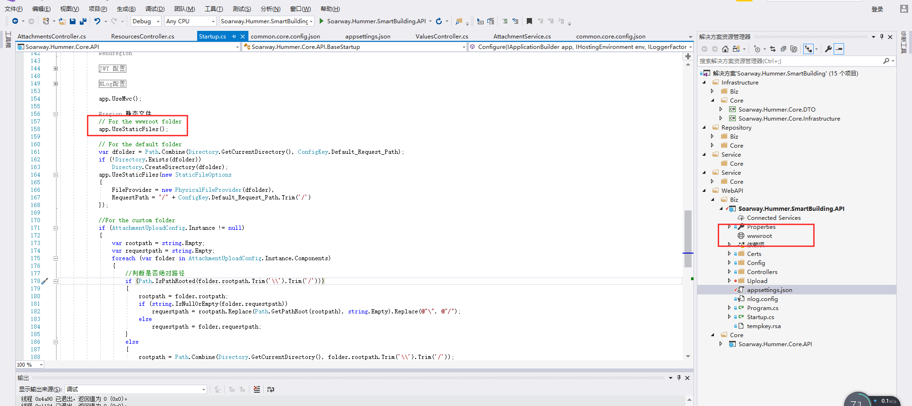

1. **github通过webhooks发送通知到Jenkins遇到的坑，设置webhooks的地址时需要以 / 结尾，否则Jenkins将收不到通知。**  

    

2. **Jenkins通过邮件发送通知**
   > 文档参考地址：http://192.168.0.225:5656/jenkins/Jenkins%E7%B3%BB%E5%88%97%E6%95%99%E7%A8%8B/%E7%AC%AC%E4%B8%83%E7%AB%A0-Jenkins%E5%AE%9E%E7%8E%B0%E6%9E%84%E5%BB%BA%E8%BF%87%E7%A8%8B%E9%82%AE%E4%BB%B6%E6%B6%88%E6%81%AF%E9%80%9A%E7%9F%A5.html

3. **.net core环境下浏览静态文件需要做的事**
   
   - **.net和.net core环境对比**

        同样是浏览网站下的图片，在.net环境下，在站点下随意建一个文件夹放进图片根据图片的虚拟路径即可访问，但在 .net core环境下就不行了，图片必须是放在wwwroot文件夹或通过UseStaticFiles指定目录才能被访问到，而且wwwroot文件夹不能是在部署目录右键新建文件夹，应该是在vs项目中建好然后发布。

        
    
   - **官方说明**

        > https://docs.microsoft.com/zh-cn/aspnet/core/fundamentals/static-files?view=aspnetcore-2.2