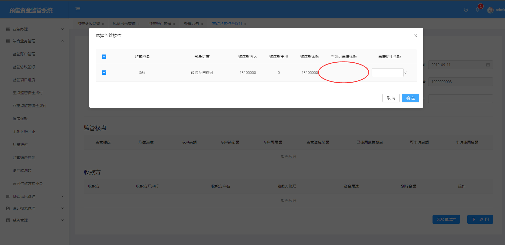
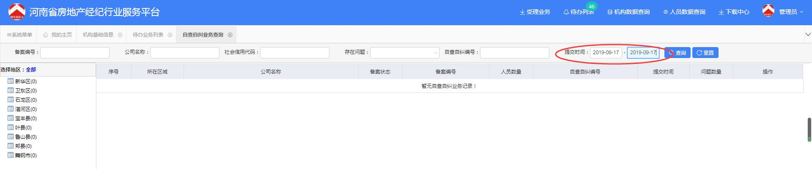
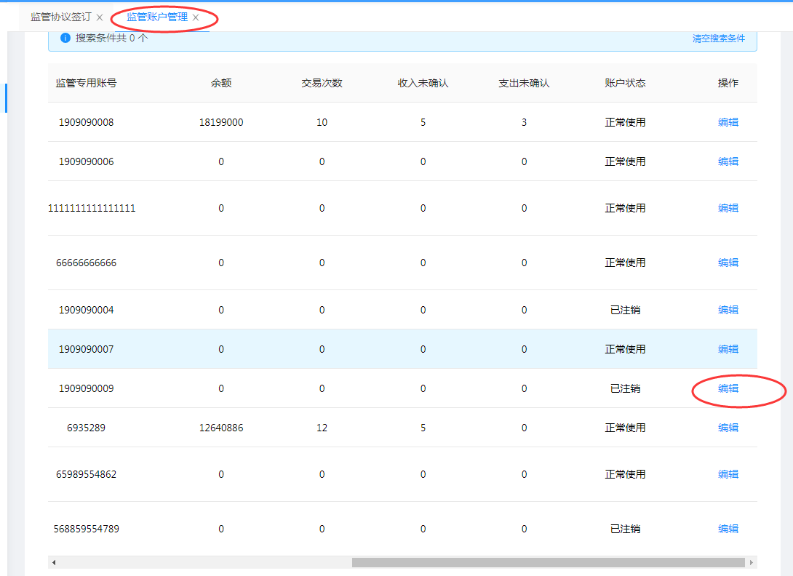
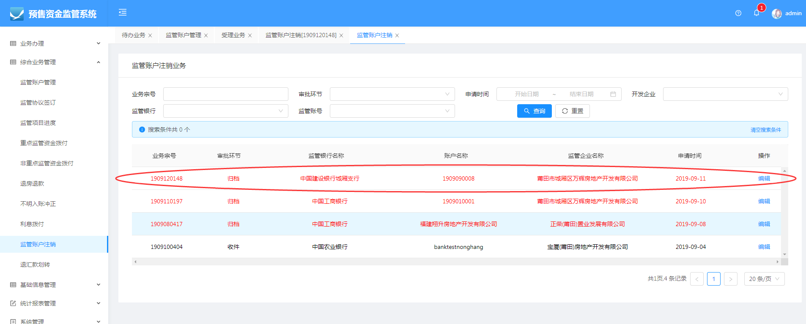
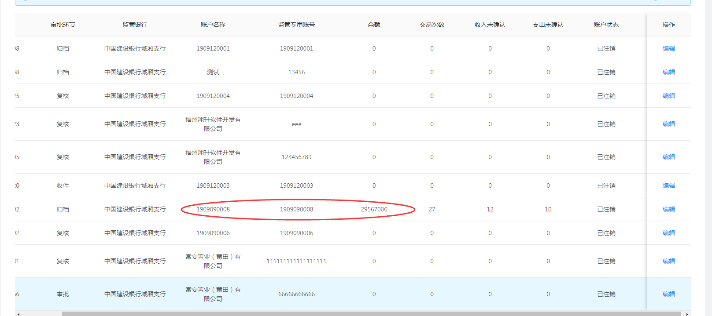
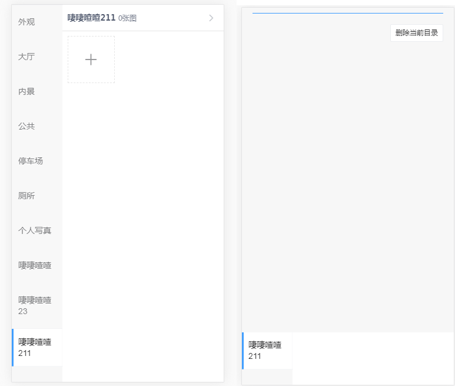
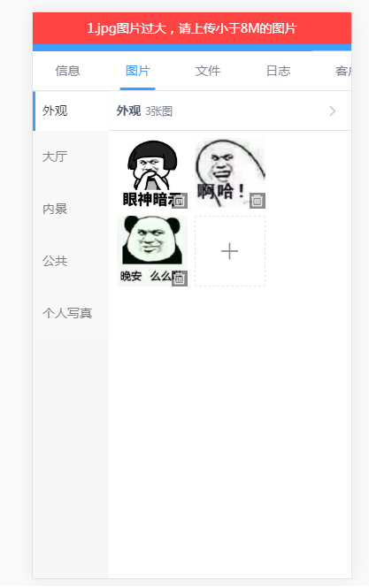
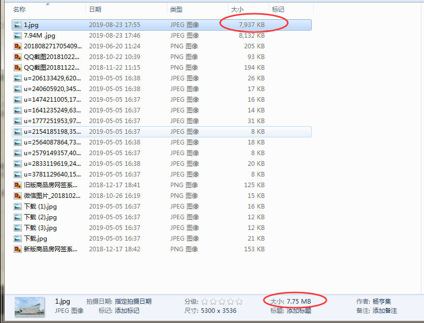
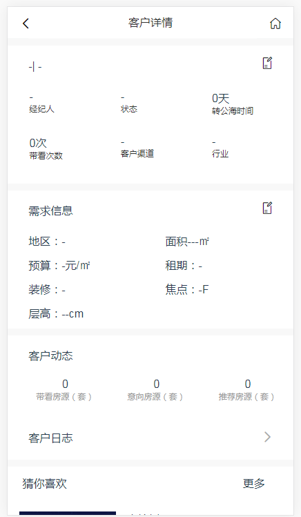
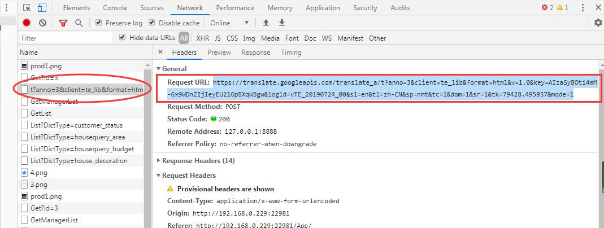

#### 1、做预售资金资金拨付业务时，选择监管楼盘，第一次进入勾选后会有默认值，但是金额未确认直接取消回到上一页面，再次点击选择监管楼盘，进入有勾选框的页面，此时勾选框默认选上了但是其所勾选应有的默认值信息会没有。需再次勾选才会出来

图1-1

*** 
#### 2、查询问题：查询的时间范围为同一天时，不能查询到在该时间范围内的项目（相同的选择的开始时间在后结束时间在前也会查不到对应数据）

图2-1

***

#### 3、做完监管开户业务，在去编辑该业务信息；该状态会变为已注销状态

图3-1

***
#### 4、做监管注销业务，只做了一笔监管注销业务，但是所有的监管账户都被注销了

图4-1

图4-2

***
#### 5、在智慧楼宇app中，项目详情→图片目录，下滑图片目录至第二页，修改第二页中的目录名称时，界面显示会错位

图5-1

***
#### 6、图片大小小于8m，为7.75MB的图片，上传时仍会提示“请上传小于8m 的图片”

图6-1

 

图6-2

***

#### 7、在智慧楼宇招商模块中：在谷歌浏览器下打开了自动翻译网页，点击客源列表中的客源进入详情页面，详情页面中数据都没了，需要在详情页面中在刷新页面详情信息才会显示

图7-1

 

图7-2
