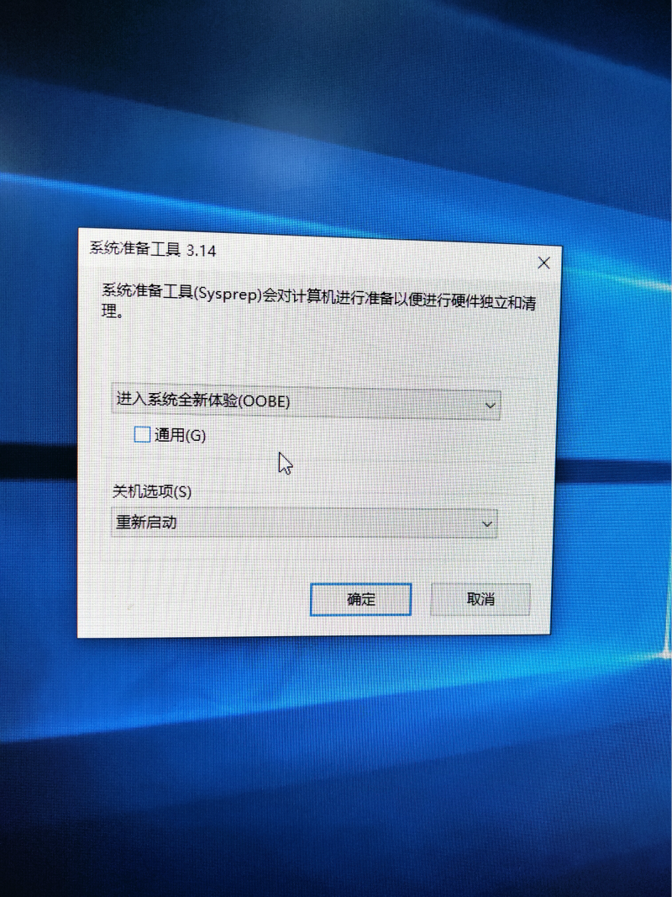

### 1. Win10系统重置：重装系统进行个人设置时出现点击键盘系统就会卡死问题的解决方案  
系统重置完成进入个人设置界面设置个人账户时发现只要点击键盘系统就会卡死，要等待一两分钟才恢复正常，但是又点击键盘时又是一样的卡死如下图：  


> 问题原因：通过查找相关资料发现可能和微软近期的几个安全更新有关：  
>Win10 1803版本的KB4516058  
>Win10 1809版本的KB4512578  
>Win10 1903版本KB4515384   

由于这是微软的bug，完全解决还需要等待微软自己解决，以下介绍一种临时的解决方案，就是卸载相关的安全更新补丁，具体方法（以1809版本为例）：  

第一步：在目前账号设置前的任意界面（比如系统语言选择界面），如果已经到账号界面键盘失灵，请后退到语音选择界面；  

第二步：键盘同时按Ctrl+Shift+F3这三个键，此时电脑进入特殊系统设置模式(审核模式)；

第三步：出现如下提示框，不要关闭，不要做任何选择；  

  

第四步：接下来就是卸载更新，单击开始菜单，选择【设置】，然后再进入【更新和安全】，选择【查看已安装更新历史记录】，再点击【卸载更新】选项，在更新中，找到对应版本的安全更新，然后右键选择卸载即可。

第五步：卸载完之后会提示是否重启，选择立即重启，重启后还是默认进入审核模式，此时在弹出的窗口中选择“进入系统全新体验(OOBE))”，点击确定，电脑重启进入系统重装个人设置向导就不会再出现点击键盘卡顿的问题了。

### 2. SQL Server 2012 自动增长列，值跳跃问题(自增增加1000)
#### 2.1. 介绍
从 SQL Server 2012 版本开始， 当SQL Server 实例重启之后，表格的自动增长列的值会发生跳跃，而具体的跳跃值的大小是根据增长列的数据类型而定的。如果数据类型是 **整型(int)**，那么跳跃值为**1000**；如果数据类型为**长整型(bigint)**，那么跳跃值为**10000**。这个奇怪的问题只在 SQL Server 2012 及更高的版本中存在，SQL Server 2012之前版本不存在此问题。微软官方称这是一个功能不是bug，在很多场景下是很有用处的。但是在我们自己的实际案例中可能是不需要这个功能的，接下来就介绍一下如何关闭这个功能。

#### 2.2 解决方案
如果我们对微软提供的这个 “功能” 不感兴趣，我们可以通过两种途径来关闭它。  
**1. 使用序列 (Sequence)**  
首先，我们需要移除表格的自增列。然后创建一个不带缓存功能的序列，根据此序列插入数值。 下面是示例代码：
``` sql
CREATE SEQUENCE Id_Sequence
    AS INT
    START WITH 1
    INCREMENT BY 1
    MINVALUE 0
    NO MAXVALUE
   NO CACHE
insert into P_Identity_1 values('Mr.Tom',NEXT VALUE FOR Id_Sequence); 
insert into P_Identity_1 values('Mr.Jackson',NEXT VALUE FOR Id_Sequence); 
```
> 设置序列会在系统表*sys.sequences*中加入一条记录，用来表示序列的一些状态，具体如下图：

  

**2. 为SQL Server 注册启动参数 -t272**  
打开SQL Server配置管理器。 选择 SQL Server 2012 实例，右键， 选择属性菜单。在弹出的窗口中找到启动参数，然后注册 -t272。 完成之后重启下图中的SQL Server(SQLSERVER2012)，并重启数据库，之后进行bug重现的操作，验证问题是否已解决。

  

### 3. MarkDown支持代码段高亮显示的语言
| 名称        | 关键字                                       |
| :--------- | :------------------------------------------ | 
| AppleScript | applescript |
| ActionScript 3.0    | actionscript3 , as3  |
|Shell	|bash , shell|
|ColdFusion|	coldfusion , cf	|
|C	|cpp , c	|
|C#	|c# , c-sharp , csharp	|
|CSS	|css|
|Delphi	|delphi , pascal , pas	|
|diff&patch	|diff patch	|
|Erlang|	erl , erlang|
|Groovy	|groovy|
|Java	|java	|
|JavaFX	|jfx , javafx	|
|JavaScript	|js , jscript , javascript	|
|Perl	|perl , pl , Perl	|
|PHP	|php	|
|text	|text , plain	|
|ython|	py , python	|
|Ruby	|ruby , rails , ror , rb	|
|SASS&SCSS	|sass , scss	|
|Scala|	scala	|
|SQL|	sql	|
|Visual Basic	|vb , vbnet	|
|XML	|xml , xhtml , xslt , html	|
|Objective C	|objc , obj-c	|
|F#	|f# f-sharp , fsharp	|
||xpp , dynamics-xpp	|
|R|	r , s , splus	|
|matlab|	matlab|
|swift	|swift|
|GO	|go , golang	|

### 4. IIS部署站点访问时出现503错误或者拒绝访问的解决方案  

**1. 背景**  

操作系统：Windwos Server 2008 R2 Enterprise  
数据库：SQL SERVER 2012  
IIS版本：6.1  
程序：微网站模块管理后端(.net core 2.2)

**2. 现象**  

程序部署好后，访问站点出现503 Service Unavailable错误，如下图：

  

**3. 解决方案**  

初步分析导致错误的原因是应用程序池账号的权限不足所致，创建应用程序池时默认的账号为“ApplicationPoolIdentify”意为“应用程序池标识”帐户，启动应用程序池时动态创建“应用程序池标识”帐户，因此，此帐户对于应用程序来说是最安全的，但他们权限也相对较低，所以若出现上述现象可将应用程序池 -> 高级设置 -> 进程模式 -> 标识修改为“LocalSystem”即可，如下图：

  