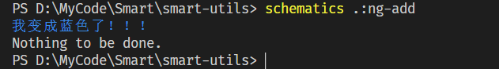
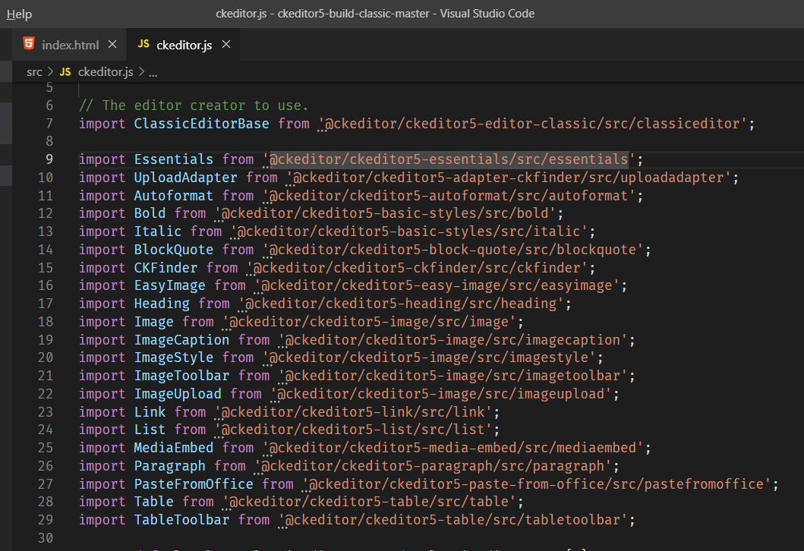
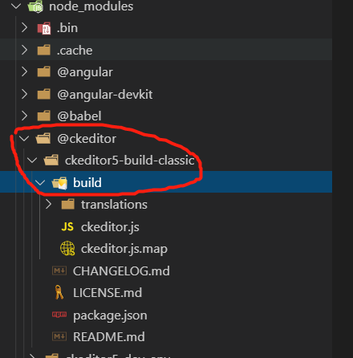
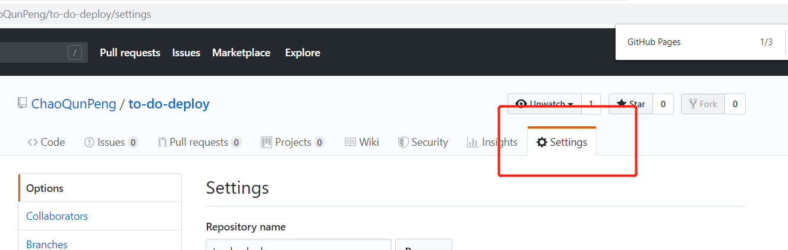
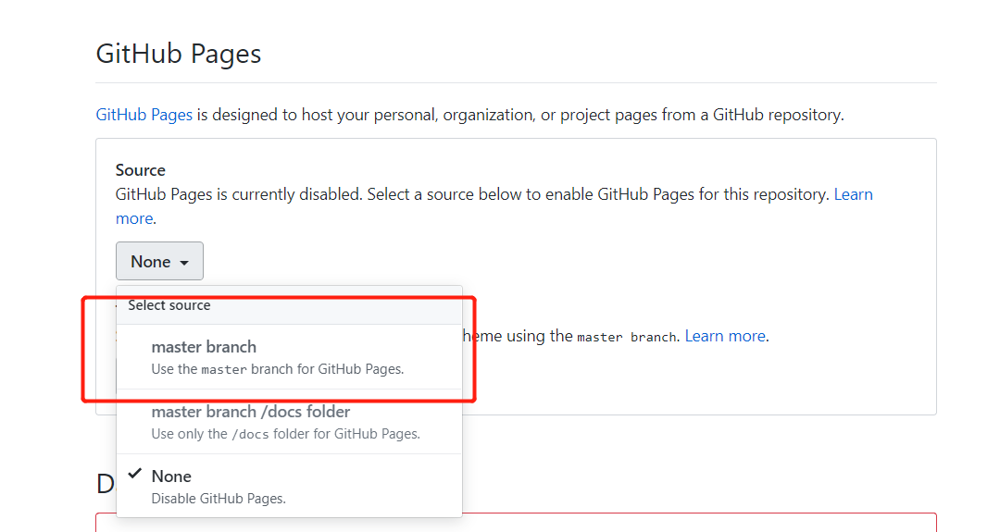
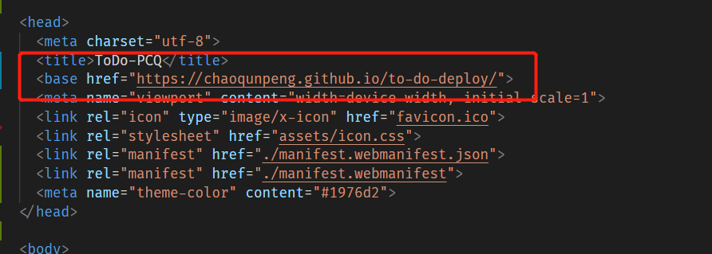

### 一、ASCLL装饰器 - VS Code插件  

vscode 插件市场搜索 ASCIIDecorator


### 二、chalk - 一个npm package

终端字符串样式设置

 

```
$ npm install chalk

使用方式

import chalk from "chalk";

console.log(`${chalk.blue(`我变成蓝色了！！！`)}`);
```

### 三、CKeditor - 一款富文本编辑器
这里只说如何在Angular中使用。目前最新版本时CKEditor 5。

[官网使用教程，简洁清晰明了](https://ckeditor.com/docs/ckeditor5/latest/builds/guides/integration/frameworks/angular.html)

[CKEditor Examples](https://ckeditor.com/docs/ckeditor5/latest/examples/builds/classic-editor.html)


*注意

```html
这里的config要使用字符串的形式

// html
// 正确的方式
<ckeditor [editor]="Editor"  [config]="{ toolbar: [ 'heading', '|', 'bold', 'italic' ] }">
</ckeditor>

// 错误的方式

<ckeditor [editor]="Editor"  [config]="config">
</ckeditor>

// ts
config={toolbar:...}
```


按照官网提供的步骤我们下载的都是classic经典版，经典版里已经有了一些内置的功能，但是有些我们自己需要的并没有，需自行构建。

[CKEditor Classic Build地址](https://github.com/ckeditor/ckeditor5#builds)

我们将这个项目下载下来，打开后启动其中sample/index.html，可以看到此时这个编辑器就是classic款的编辑器。
然后我们在注意一下src/ckeditor.js，相信看到这里你就明白了，这些插件构成了我们的classic editor。

 

所以，我们想要给我的编辑增加或减少功能，都可以在这里进行，然后再打包。可以从
[这里](https://github.com/ckeditor/ckeditor5#features)下载。

构建完成后，我们只需把build目录下的文件copy到Angular项目中的node_modules/@ckeditor/ckeditor5-build-classic/build/里就行。

 


### 四、Git Page
用户部署静态页面

 

 

*注意 ，这里的base href一定要改成github域名+仓库名+/,最后有个斜杠！！！同时目录里必须要有index文件！！！

 


### 五、Angular Material
Angular 官方的组件库

[Angular Material官网](https://material.angular.cn/)