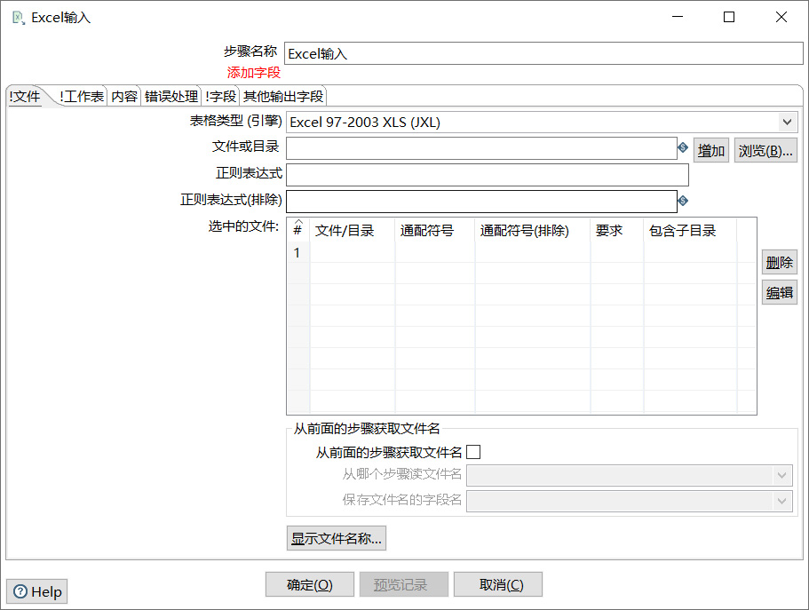

### 1.  Kettle下实现Excel数据导入至数据库
一、安装kettle
1. 解压下载下的压缩包，如：pdi-ce-8.2.0.0-342，然后找到.bat批处理文件Spoon双击运行,运行过程中会出现命令提示符,运行成功后如下图所示；
 

二、配置kettle链接属性
1. 连接数据库
 
2. 点击页签"核心对象",展开"输入"列表将"Excel输入"模块拖入右侧空白区域；
 
3. 双击“Excel输入”模块，展开Excel输入配置界面
 
（1）在弹出框中选择“表格类型”为“Excel 2007 XLSX (Apache POI)”；
（2）点击“文件或目录“后的“浏览”选择需要导入的Excel表格，点击“增加”添加至选中文件列表中；
 
4. 展开"输入"列表将"表输出"模块拖入右侧空白区域；
 
5. 双击“表输出”展开“表输出”链接配置页面；
 
6. 按住Shift按键将两个模块依次连接起来；
 


### 2. setHeaders
setHeaders增加设置的属性，之前定义的还会在，只是增加
```javascript
req = req.clone({
        setHeaders: {
          'Authorization': "Bearer " + localStorage.getItem("Authorization")
        },
      })
```     

### 3.样式修改： :host ::ng-deep
在使用一些第三方的组件的时候，要修改组件的样式。
这种情况下使用:
```css
:host ::ng-deep .className{
    新的样式......
}
```
:host 表示选择器，选择当前的组件。
::ng-deep 可以忽略中间className的嵌套层级关系。直接找到你要修改的className。
不过官方文档上说，ng-deep 在未来的版本中将被放弃，不知道未来会变成什么样的语法。使用的时候，记得为未来Angular升级带来的变化做准备。