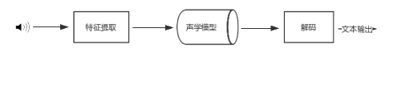
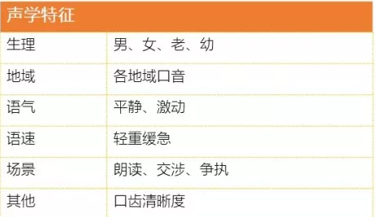
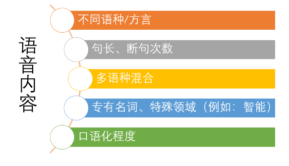
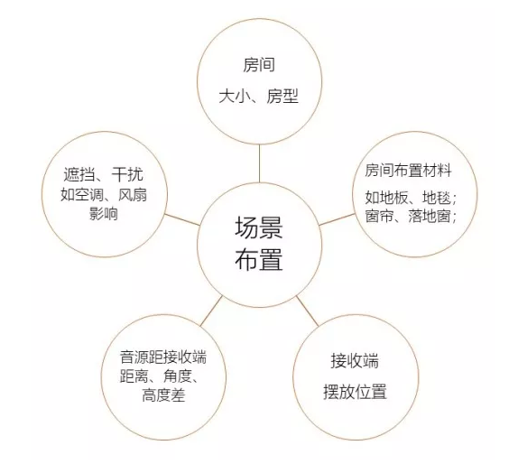
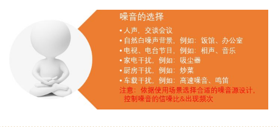

# 浅谈语音测试
近年来，语音产品炙手可热，智能语音已遍布我们生活中的各个角落。
· 苹果手机siri
“Siri，打电话给张三”   “正在打电话给张三”
· 百度地图小度
“小度，怎么到CBD” “好的，到CBD，已为您规划好路线”
· 10086-6（智能语音客服）
“话费查询”  “好的，话费查询，您当前话费合计**元”

如此方便，有没有感觉整个世界是那么美好。但是有一天深夜突然响起了诡异的怪笑，有没有很恐怖呢~~~~~
2018年3月8日亚马逊智能音箱半夜发出怪笑，据官方解释称，Alexa可能误识别了让Alexa笑的常见单词和短语……

如何尽量避免此类事情的发生呢？语音识别能力很关键。
语音识别的整体流程：
  

站在测试角度思考如何保证语音识别能力，最简单的切入点是最终生成文本内容的校验。准备一批语音的文本内容，与识别出的文本内容做对比，获取识别的准确率。
但是这种准确率统计脱离了实际使用场景，存在较大的偏差。语音测试相比传统测试更开放，场景的设计成了语音测试的难点。
语音产品使用过程中使用对象及所处环境都是不同的，故语音测试场景的设计，可以从识别对象、场景布置两方面来考虑。

  

## 1按识别对象
按照识别对象可以分成两大类，说话人的识别和语音内容的识别。每个人说话的声音是不尽相同的，说话人的识别从声学特征方面考虑，如生理、地域、语气、语速等。

中华文化博大精深，同样的意思表达可能有多种说法，每个人也有自己独特的表达方式。语音内容的识别可以从这几个方面着手。

  

## 2按不同使用场景
智能语音产品发展势头正猛，存在不同的使用场合，结合产品选择不同的场景布置。

  

“我想岁月静好，奈何世事纷扰” 。人世嘈杂，智能语音使用中存在各种干扰声音，如何选择噪音干扰？

  
