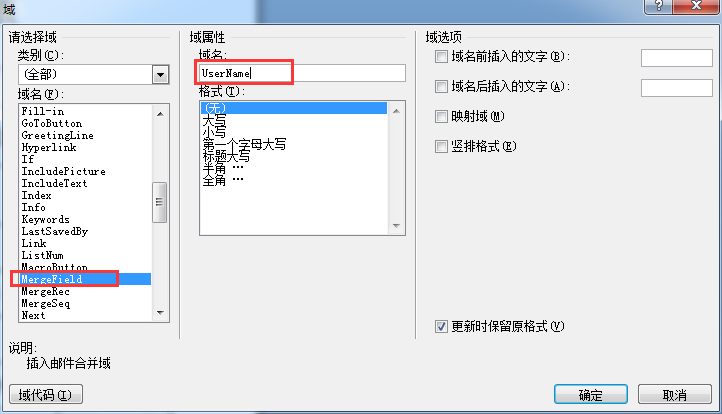

## Aspose Word模板使用总结

1.创建word模版，使用MergeFeild绑定数据

> 1.1 word模版创建的格式一定要 **标准** **再标准**，不标准的话生成出来的PDF格式就乱了。

> 1.2 生成Model对象 «UserName» «Gender» «Address»单个对象字段名称。

> 1.3 注意：这里并不是输入"《”和“》”就可以了，而是必须在菜单的"插入→文档部件→域”找到MergeField并输入相应的域名

```csharp
   //创建循环数据的模版，这里的循环数据类似页面的for结构，不拘泥于形式table。开始已«TableStart:UserList»结束已«TableEnd:UserList»
   «TableStart:UserList»

   姓名：«UserName»
   性别：«Gender»
   地址：«Address»

   «TableEnd:UserList»

```

 
 

#### NuGet包引用 *Aspose.Words*

1. 框架这边封装好的生成Word模板转PDF的方法只要调用

```csharp 
    MemoryStream m = new MemoryStream();
    string tempPath = @"D:\111\南安市存量房转让申请表.doc";
    string outputpdf = @"D:\111\南安市存量房转让申请表.pdf";
    IDocDataTable docDataTable = AdddocDataTable();
    //文件生成的文件地址
    string outputPath = DocRender.Render<IDocDataTable>(tempPath, outputpdf, docDataTable, SaveFormat.Pdf);

    //返回一个流Stream
    var stream = FTPHelper.FileToStream(tempPath);

    var ms = DocRender.Render<IDocDataTable>(stream, docDataTable, SaveFormat.Pdf);
    var file = FTPHelper.StreamToFile(ms, @"D:\111\test.pdf");
    return new JsonResult(statusResult);
```

2. 框架里生成文件的代码
   
```csharp

     var doc = new Document(tempfile);
    //Model对象
    var dict = DitcToStatus(docTable.Models);
    var keys = dict.Keys.ToArray();
    var val = dict.Values.ToArray();
    //合并模版，相当于页面的渲染
    doc.MailMerge.Execute(keys, val);
    //DataTable
    DataSet dataSet = DocRenderDataSet(docTable, SaveFormat.Doc);
    //合并模版，相当于页面的渲染
    doc.MailMerge.ExecuteWithRegions(dataSet);
    var docStream = new MemoryStream();
    doc.Save(docStream, SaveOptions.CreateSaveOptions(SaveFormat.Doc));
    doc.Save(templatedoc);
    string result = FTPHelper.ReadFile(templatedoc);
    RenderService.GenerateFile(result, templatepdf, saveFormat);
    doc.Save(templatepdf, saveFormat);

```

3. 数据模板继承*IDocDataTable*

```csharp

    public IDocDataTable AdddocDataTable()
    {
        IDocDataTable docDataTable;
        Model model = new Model();
        model.Tables = new Dictionary<string, List<object>>();
        List<object> list = new List<object>();
        List<object> list1 = new List<object>();
        DataInfo dataInfo = new DataInfo();
        dataInfo.Address = "福州仓山区";
        dataInfo.Amount = "198000000";
        dataInfo.ContractNumber = "201909180008";
        dataInfo.Date = "2019-09-20";
        dataInfo.IsA = false;
        dataInfo.IsB = true;
        dataInfo.IsC = false;
        //"☑";打勾
        //"□";
        //UserList
        CasePayees casePayee = new CasePayees();
        casePayee.DialAccountName = "DialAccountName333";
        casePayee.Gender = "男";
        casePayee.Address = "工商银行";
        casePayee.UserName = "张四";
        CasePayees casePayee1 = new CasePayees();
        casePayee1.DialAccountName = "DialAccountName444";
        casePayee1.Gender = "女";
        casePayee1.Address = "建设银行";
        casePayee1.UserName = "张4444";
        CasePayees casePayee2 = new CasePayees();
        list.Add(casePayee1);
        list.Add(casePayee);
        list.Add(casePayee2);
        //UserList1
        CasePayees casePayee3 = new CasePayees();
        casePayee3.Gender = "男";
        casePayee3.Address = "鼓楼";
        casePayee3.UserName = "王五";
        CasePayees casePayee4 = new CasePayees();
        casePayee4.Gender = "女";
        casePayee4.Address = "台江";
        casePayee4.UserName = "赵六";
        CasePayees casePayee5 = new CasePayees();
        CasePayees casePayee6 = new CasePayees();
        list1.Add(casePayee3);
        list1.Add(casePayee4);
        list1.Add(casePayee5);
        list1.Add(casePayee6);
        model.Tables.Add("UserList", list);
        model.Tables.Add("UserList1", list1);

        model.Models = dataInfo;
        docDataTable = model;
        return docDataTable;
    }

    public class Model : IDocDataTable
    {
        public Dictionary<string, List<object>> Tables { get; set; }
        public object Models { get; set; }
    }
    public class CasePayees
    {
        public string DialBankName { get; set; }
        public string DialAccountName { get; set; }
        public string DialAccountNumber { get; set; }
        public string Purpose { get; set; }
        public string UserName { get; set; }
        public string Gender { get; set; }
        public string Address { get; set; }
    }
    public class DataInfo
    {
        public string Address { get; set; }
        public string ContractNumber { get; set; }
        public string Amount { get; set; }
        public string Date { get; set; }
        public bool IsA { get; set; }
        public bool IsB { get; set; }
        public bool IsC { get; set; }
    }
```