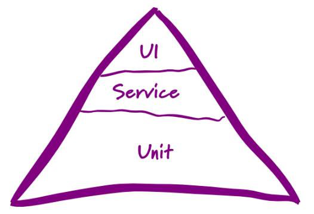
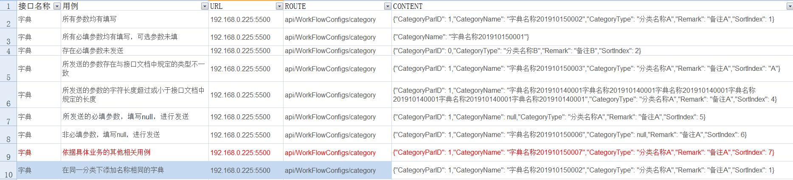
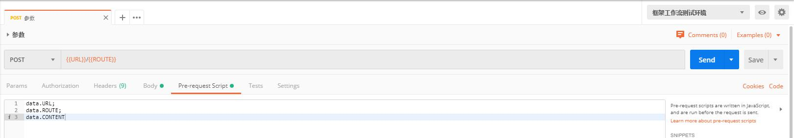
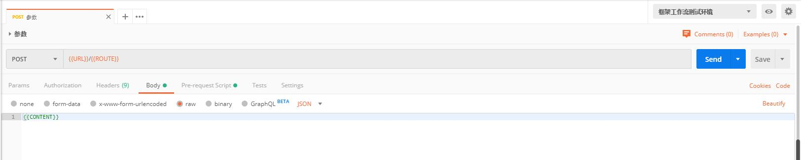

### 1、自动化测试
#### 自动化测试概念
 自动化测试是指，软件测试的自动化，在预设状态下运行应用程序或者系统，预设条件包括正常和异常，最后评估运行结果。是一个将人为驱动测试行为转换为机器执行的过程。
#### 自动化测试优势
1.提高出现问题后的响应速率
2.降低回归成本
3.提高回归覆盖率
4.提高回归效率
5.提高回归的稳定性
#### 适用对象

#####  1.需求稳定，不会频繁变更
自动化测试最大的挑战就是需求的变化，而自动化脚本本身就需要修改、扩展、debug，去适应新的功能，如果投入产出比太低，那么自动化测试也失去了其价值和意义；
折中的做法是选择相对稳定的模块和功能进行自动化测试，变动较大、需求变更较频繁的部分用手工测试；
##### 2.多平台运行，组合遍历型、大量的重复任务
测试数据、测试用例、自动化脚本的重用性和移植性较强，降低成本，提高效率和价值；
##### 3.软件维护周期长，有生命力
自动化测试的需求稳定性要求、自动化框架的设计、脚本开发与调试均需要时间，这其实也是一个软件开发过程，如果项目周期较短，没有足够的时间去支持这一过程，那自动化测试也就不需要了；
##### 4.被测系统开发较为规范，可测试性强
主要出于这几点考虑：被测试系统的架构差异、测试技术和工具的适应性、测试人员的能力能否设计开发出适应差异的自动化测试框架；
#### 如何实施自动化测试

##### 1.分析
总体把握系统逻辑，分析系统的核心体系架构。
##### 2.设计
设计测试用例，测试用例要足够明确和清晰，覆盖面广而精。
##### 3.实现
实现脚本，有两个要求：一是断言，二是合理的运用参数化。
##### 4.执行
脚本的执行过程中异常需要仔细分析原因。
##### 5.总结
测试结果的分析，和测试过程的总结是自动化测试的关键。
##### 6.维护
自动化测试脚本的维护是一个难以解决但又必须要解决的问题。
##### 7.分析
在自动化测试过程中深刻的分析自动化用例的覆盖风险和脚本的维护成本。

#### 自动化测试分层及常见的测试工具

##### 单元自动化测试（数据处理层）
指对软件中最小的可测试单元进行检查和验证，一般需要借助单元测试框架，如java的Junit、TestNG，python的unittest，常见的手段是code review等；
##### 接口自动化测试（业务逻辑层）
主要检查验证模块间的调用返回以及不同系统、服务间的数据交换
常见的接口测试工具有postman、jmeter、loadrunner等；
##### UI自动化测试（GUI界面层）
UI层是用户使用产品的入口，所有功能通过这一层提供给用户，测试工作大多集中在这一层
            常见的测试工具有UFT、Robot Framework、Selenium、Appium等；
性价比：按照测试金字塔模型以及投入/产出比，越向下，回报率越高；
Google的自动化分层投入占比：
70%的投入为单元测试，
20%为集成、接口测试，
10% 为UI层的自动化测试
##### 自动化测试面临的挑战：
            面临的最大挑战就是变化，因为变化会导致测试用例运行失败，所以需要对自动化脚本不断debug，如何控制成本、降低成本是对自动化测试工具以及人员能力的挑战。
			

***

### 2、postman的读取本地文件作为参数
##### 背景:在测试工作流模块接口时碰到比较多的是在新增或修改接口时需要发送不同情况的参数，如：所有参数都有写、必填项未填写、所填参数类型与接口文档定义的不一致等；
#### 步骤：

##### ①在excel表格中写用例，表头中填写的字段分别对应url、route、content，也可在表中对测试点击接口名称进行备注方便后面修改

图1

***

##### ②在pre-request script中对要用到的变量进行定义，这里的变量名需与表头中的一致

图2

***

##### ③在url及body中分别填入要引用的变量

图3

***
