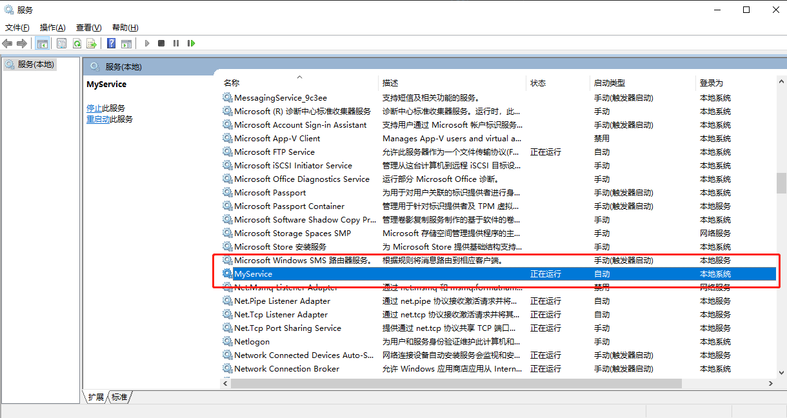

### 1. EF Core 数据库迁移命令整理(Migration) 

| 迁移命令描述                  | CLI(Command line interface)命令  |  PMC(Package Manager Console)命令 |
| :-------------------- | :----------------------------------------------------------------- | :------------ |
| 创建迁移：migrationname为迁移名称            | dotnet ef migrations add migrationName              |  add-migration migrationName |
| 移除迁移(删除最近的一次迁移)           | dotnet ef migrations remove              |  remove-migration |
| 应用所有的迁移(使迁移文件应用到数据库)            | dotnet ef database update              |  update-database |
| 指定版本进行迁移          | dotnet ef database update migrationName              |  update-database migrationName |
| 生成对应版本的脚本         | dotnet ef migrations script              |  Script-Migration |
| 查看迁移列表           | dotnet ef migrations list              |   |
| 查看数据库上下文信息           | dotnet ef dbcontext info              |   |

> PMC


#### 1.1. 示例
**1. 创建迁移：**  
``` csharp
add-migration migrationname  //名称可随意填写，推荐根据脚本内容命名
```
**2. 移除迁移：**  
``` csharp
remove-migration //移除最后一次迁移
```
**3. 应用迁移到数据库：**  
``` csharp
update-database  //应用迁移到数据库
update-database migrationname  //相当于版本回滚操，比如有版本1，2，3 此时我想回滚到版本1 就直接 update-database 1,此时数据库中已经更新到1版本了，然后在两次remove-migration把2和3的迁移文件删除就好了
```
**4. 生成对应版本的脚本：**  
``` csharp
Script-Migration //默认生成所有迁移文件对应的sql语句
Script-Migration -o [FILE] //指定脚本生成路径，可以是相对路径
Script-Migration -From start_migrationname -To end_migrationname  //生成指定区间的脚本，注意这里的from是从0开始的，所以不会生成from对应的迁移文件的sql
Script-Migration -From 0  //生成第一个迁移文件的sql
```
**5. 生成脚本到指定相对路径（一）：**  
``` csharp
Script-Migration -o V1.0.6.8.sql
```
生成的脚本文件会在与选择的“默认项目”在同一级目录，若文件V1.0.6.8.sql不存在会自动创建，如下图：


**6. 生成脚本到指定相对路径（二）：**  
``` csharp
Script-Migration -o Soarway.Hummer.Core.API/bin/Debug/V1.0.6.8.sql
```
得到如下结果：


### 2. 使用命令行启动.Net Core项目中dotnet run 和 dotnet xxx.dll的区别

**dotnet run** 命令的执行环境为诸如`Api.csproj`这样的项目文件所在的项目文件夹，而不是bin 或者obj文件夹，并且dotnet run 运行后，首先会检测程序中是否存在 bin 文件夹，如果不存在就会创建它，然后把生成的文件放到 bin 文件夹。  
**dotnet xxx.dll** 如果你需要运行一个 dll 程序，使用 dotnet 命令：`dotnet xxx.dll`，而不是 dotnet run xxx.dll，比如，已经发布的项目，进入发布文件夹，直接 dotnet xxx.dll，xxx是项目名称。

> 除以上介绍的两种命令外，还有使用`dotnet restore`来还原依赖项、使用`dotnet build`来编译项目等。

### 3.一个很好用的服务封装程序 - NSSM(Non-Sucking Service Manager) 
#### 3.1. 介绍
NSSM是一个服务封装程序，它可以将普通exe程序封装成服务，使之像windows服务一样运行。同类型的工具还有微软自己的srvany，不过nssm更加简单易用，并且功能强大。它的特点如下：

    1.支持普通exe程序（控制台程序或者带界面的Windows程序都可以）  
    2.安装简单，修改方便  
    3.可以重定向输出（并且支持Rotation）  
    4.可以自动守护封装了的服务，程序挂掉了后可以自动重启  
    5.可以自定义环境变量  

#### 3.2. 官网地址

NSSM的官网是：https://nssm.cc/ ，十分简陋，但程序功能可是非常强大和全面的，下面我来一步步演示它如何使用。

  

#### 3.3. 使用NSSM实现以Windows服务方式运行.NET Core程序

**1.下载NSSM**  

到官网下载NSSM，选择更新的版本，下载下来后找到对应的exe文件，叫nssm.exe。(注意有32位版和64位版的分别)。它是个绿色软件，不需要安装，仅此一个exe文件，把这个文件复制到C:\Windows\System32目录下，之后经常要用。

**2.安装服务**  

以管理员的身份打开命令行工具，输入命令`nssm install <servicename>`，执行此命令后出现如下界面：大部分情况下我们只要使用第一个界面的配置就够了。

 

`Path：`dotnet.exe所在的目录，一般在 C:\Program Files\dotnet 。  
`StartUp directory：`发布的项目所在目录  
`Argument：`启动项目对应的dll文件  

配置完成后点击 install service 即可，此时我们打开Windows服务来查看我们安装的服务。  

 

**3.启动服务** 

可以到Windows服务界面手动启动也可以使用命令行`nssm start <servicename>`启动。  
这里分享一个我在启动时遇到的一个错误：当我启动服务时，出现如下图的错误，服务状态变为“暂停”。这是由于一开始我的 dotnet.exe 的路径配置错误导致的，我配置成“C:\Program Files (x86)\dotnet”，正确配置应该是“C:\Program Files\dotnet”

 

**4.服务管理**

除了以上看到的两种命令外，还有一些其他的常用命令：  

    重启服务: nssm restart <servicename>
    停止服务：nssm stop <servicename>
    修改参数: nssm edit <servicename>
    删除服务：nssm remove <servicename> 或者 nssm remove <servicename> confirm
    查看服务状态：nssm status <servicename>
