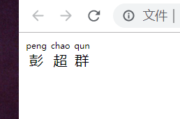

# HTML ruby元素



HTML <ruby> 元素 被用来展示东亚文字注音或字符注释。

```html
    <ruby>
      彭
      <rt>peng</rt>
    </ruby>
    <ruby>
      超
      <rt>chao</rt>
    </ruby>
    <ruby>
      群
      <rt>qun</rt>
    </ruby>
```


# CSS 变量
var()函数可以代替元素中任何属性中的值的任何部分。var()函数不能作为属性名、选择器或者其他除了属性值之外的值。

```css
:root {
      --primary-color: #000;
}

div { 
  color: var(--primary-color);
}
```