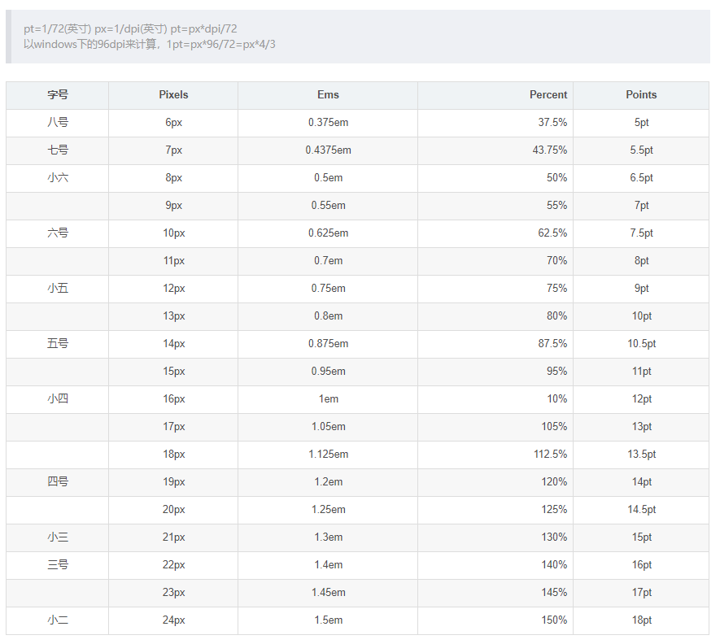

# pm2 #
pm2是一个进程管理工具,可以用它来管理你的node进程，并查看node进程的状态，当然也支持性能监控，进程守护，负载均衡等功能
1. 安装npm install -g pm2
2. 常用命令

   开启关闭

   pm2 start server.js //启动server.js进程

   pm2 start server.js -i 4 //启动4个server.js进程

   pm2 restart server.js //重启server.js进程

   pm2 stop all // 停止所有进程

   pm2 stop server.js //停止server.js进程

   pm2 stop 0 //停止编号为0的进程

   查看：

   pm2 list //查看当前正在运行的进程

   pm2 show 0 //查看执行编号为0的进程

   实时监控:

   pm2 monit //监控当前所有的进程

   pm2 monit 0 //监控批评行编号为0的进程

   pm2 monit server.js //监控名称为server.js的进程

   日志：

   pm2 logs //显示所有日志

   pm2 logs 0 //显示执行编号为0的日志
   
   pm2 logs server.js //显示名称为server.js的进程

   pm2 flush  //清洗所有的数据[注：我没有试出来效果]


3. 配置参数

```javascript
{
    "apps": {
        "name": "alex",                             // 项目名          
        "script": "index.js",                      // 执行文件
        "cwd": "./",                                // 根目录
        "args": "",                                 // 传递给脚本的参数
        "interpreter": "",                          // 指定的脚本解释器
        "interpreter_args": "",                     // 传递给解释器的参数
        "watch": true,                              // 是否监听文件变动然后重启
        "ignore_watch": [                           // 不用监听的文件
            "node_modules",
            "logs"
        ],
        "exec_mode": "cluster_mode",                // 应用启动模式，支持fork和cluster模式
        "instances": 4,                             // 应用启动实例个数，仅在cluster模式有效 默认为fork；或者 max
        "max_memory_restart": 8,                    // 最大内存限制数，超出自动重启
        "error_file": "./logs/err.log",         // 错误日志文件
        "out_file": "./logs/out.log",           // 正常日志文件
        "merge_logs": false,                         // 设置追加日志而不是新建日志
        "log_date_format": "YYYY-MM-DD HH:mm:ss",   // 指定日志文件的时间格式
        "min_uptime": "60s",                        // 应用运行少于时间被认为是异常启动
        "max_restarts": 30,                         // 最大异常重启次数，即小于min_uptime运行时间重启次数；
        "autorestart": true,                        // 默认为true, 发生异常的情况下自动重启
        "cron_restart": "",                         // crontab时间格式重启应用，目前只支持cluster模式;
        "env": {
           "NODE_ENV": "production",                // 环境参数，当前指定为生产环境 process.env.NODE_ENV
           "REMOTE_ADDR": "爱上大声地"               // process.env.REMOTE_ADDR
        },
        "env_dev": {
            "NODE_ENV": "development",              // 环境参数，当前指定为开发环境 pm2 start app.js --env_dev
            "REMOTE_ADDR": ""
        },
        "env_test": {                               // 环境参数，当前指定为测试环境 pm2 start app.js --env_test
            "NODE_ENV": "test",
            "REMOTE_ADDR": ""
        }
    }
}
```
2. 相关链接：

   pm2官网： http://pm2.keymetrics.io/

   pm2-github: https://github.com/Unitech/pm2

# px、pt、em、rem 的区别 #
px(pixel)
像素，是屏幕上显示数据的最基本的点，表示相对大小(不同分辨率上px显示不同)

pt(point)
印刷行业常用的单位(磅)，等于1/72英寸，表示绝对长度

em
em是相对长度单位，基于父级元素的font-size计算字体大小。
如果未设置父级字体大小，则相对浏览器默认字体尺寸16px（1em = 16px）：10px=0.625em，
为了简化换算，在css中的body选择器中声明Font-size=62.5%，这就使em值变为 16px*62.5%=10px, 10px=1em

rem （root em）
与em的区别在于，它是相对于html根元素的。(在body标签里面设置字体大小不起作用)
既可以做到只修改根元素就成比例地调整所有字体大小，又可以避免字体大小逐层复合的连锁反应

px、pt、em、rem转化表：

 