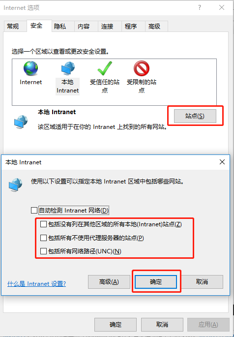
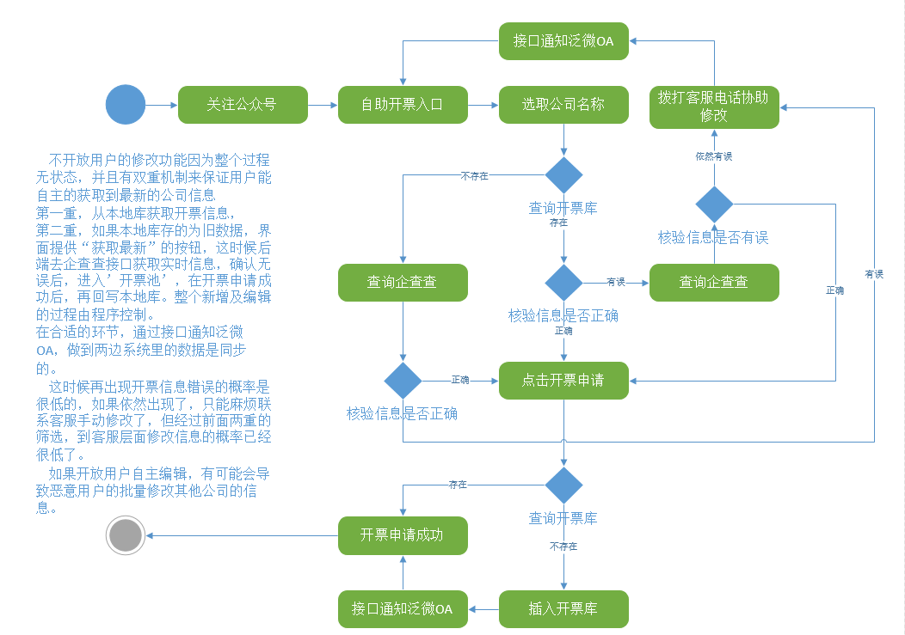
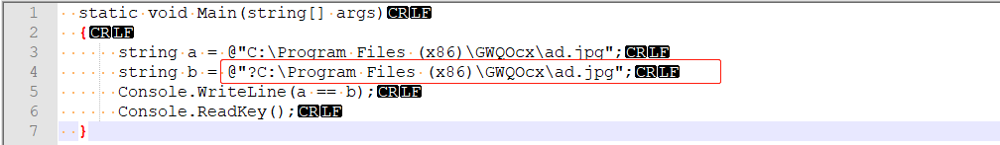

### 1. WebSocket在IE11下的问题
在IE11下使用WebSocket较为不方便，有诸多的限制。

1. IE11限制最多6个WebSocket示例，多余6个会报错。
2. 在 Internet选项-> 安全 要进行一些设置, 否则无法正常使用，如下图：
   
   

### 2. 多用图表沟通与确认
避免理解产生偏差，提高沟通效率，无需过多的前置背景的介绍，便于修改，都应该多利用软件来提升自我。
   
   

### 3. 眼见不一定为实，但有可能不一样
乍一看，a和b完全一样。其实则不然。

```csharp
  static void Main(string[] args)
  {
      string a = @"C:\Program Files (x86)\GWQOcx\ad.jpg";
      string b = @"‪C:\Program Files (x86)\GWQOcx\ad.jpg";
      // 此处输出为False
      Console.WriteLine(a == b);
      Console.ReadKey();
  }
```

造成这种结果的原因，是因为字符编码不同。这种情况常常出现与在不同编辑器或者环境下通过复制粘贴的方式拷贝字符串导致的。不常见，但是很坑。

通过NotePad++，选择ANSI编码，我们就可以看到两种的不同，b的首字符前多了一个?。这样比对的结果自然就不同的。如果这时候做的是IO读写文件的操作，你可能要兜上一大圈才能找到问题，先判断文件是否存在、是否被占用、是否在是权限问题，环境越复杂，你兜的圈子就越大。以后如果肉眼看上去没问题，不妨先把变量贴到NotePad++这种编辑器里看看，在做后续的排查。

   


   
