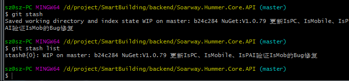

### 1. 使用iText 7生成PDF内容

1. 在NuGet 包管理器安装iText 7、iText.Html2pdf包。之前也用过个iText 7组件少安装了iText.Html2pdf就生成不了PDF。
2. 生成PDF需要注意的一个地方就是要配置系统的字体，不然生成PDF内容的时候字体是乱码。
3. [iText 7文档地址](https://github.com/itext/itext7)
 
 #### 关键代码如下：  

```csharp

    public static bool GenerateFile(string result, string path)
        {
            bool bol = true;
            try
            {
                MemoryStream fs = new MemoryStream();
                StreamWriter wr = new StreamWriter(fs);
                wr.Write(result);
                wr.Flush();
                FileInfo pdfFile = new FileInfo(path);
                ConverterProperties properties = new ConverterProperties();
                FontProvider fontProvider = new DefaultFontProvider();

                List<string> XfConfig = AppSettings.Get<List<string>>("fontconfiguration");
                XfConfig.ForEach(x =>
                {
                    fontProvider.AddFont(x);
                });

                properties.SetFontProvider(fontProvider);
                PdfWriter writer = new PdfWriter(pdfFile);
                DocumentProperties documentProperties = new DocumentProperties();
                PdfDocument pdfDoc = new PdfDocument(writer, documentProperties);
                RenderService chars = new RenderService();
                var doc = HtmlConverter.ConvertToDocument(result, pdfDoc, properties);
                doc.SetProperty(Property.SPLIT_CHARACTERS, chars);
                doc.Close();
            }
            catch (Exception ex)
            {
                _logger.Error(ex, "生成的内容出错！");
                throw new Exception("生成的内容出错！");
            }
            return bol;
        }

```

### 2. git stash 代码提交到不同分支暂存区的问题
1. 在master分支提交一份代码到 git stash暂存区。然后在切换分支到WorkFlow分支提交一份代码到 git stash暂存区。在WorkFlow分支使用git stash list可以看到master分支上的代码和WrokFlow分支上的代码。然后在WorkFlow分支使用git stash pop的时候就会把master的代码也pop到WorkFlow分支上来。
2. 



