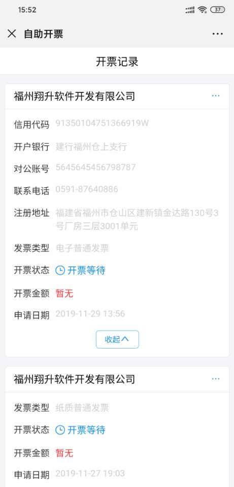
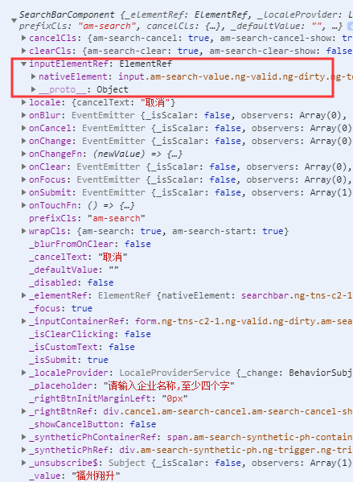

## 1、前端webSocket使用 ##

简单使用
```javascript
import { webSocket } from "rxjs/webSocket";

const subject = webSocket('ws://localhost:8081');

subject.subscribe();

subject.next(`content`);
```

webSocket多路复用
    使用 multiplex 方法来创建 Observable 以便订阅某一路消息 
```javascript
const subject = webSocket('ws://localhost:8081');

const user$ = this.subject.multiplex(
    () => ({ type: 'subscribe', tag: 'user' }),
    () => ({ type: 'unsubscribe', tag: 'user' }),
    message => message.type === 'user'
);
user$.subscribe(message => console.log(message));
subject.next(`content`);

const task$ = this.subject.multiplex(
    () => ({ type: 'subscribe', tag: 'task' }),
    () => ({ type: 'unsubscribe', tag: 'task' }),
    message => message.type === 'task'
);
task$.subscribe(message => console.log(message));
subject.next(`content`);
```

rxjs官网： https://rxjs.dev/api/webSocket/webSocket


## 2、微信内置浏览器端垂直居中字体偏上解决方案 ##

用 zorro-mobile 做项目的时候发现card 的 title属性，在PC端是没有问题的但是在微信内置浏览器上面字体会有明显的偏上 ，设置的line-height:1和flex布局 align-item:center均无效，在网上找了很多方法最后总结为：在移动端有很多手机不支持line-height,会有自己默认的22px的行高

line-height:normal;

原文链接：https://blog.csdn.net/Buddha_ITXiong/article/details/87344821

不设置行高可能会导致另一种问题，就是文字和数字无法对齐。


## 3、zorro-mobile SearchBar搜索控件 ##

```javascript
//1.0.1
@ViewChild('searchBar', { static: false }) searchBar: any;
let input: ElementRef = (this.searchBar || {}).inputElementRef;
input.nativeElement.blur();
```

