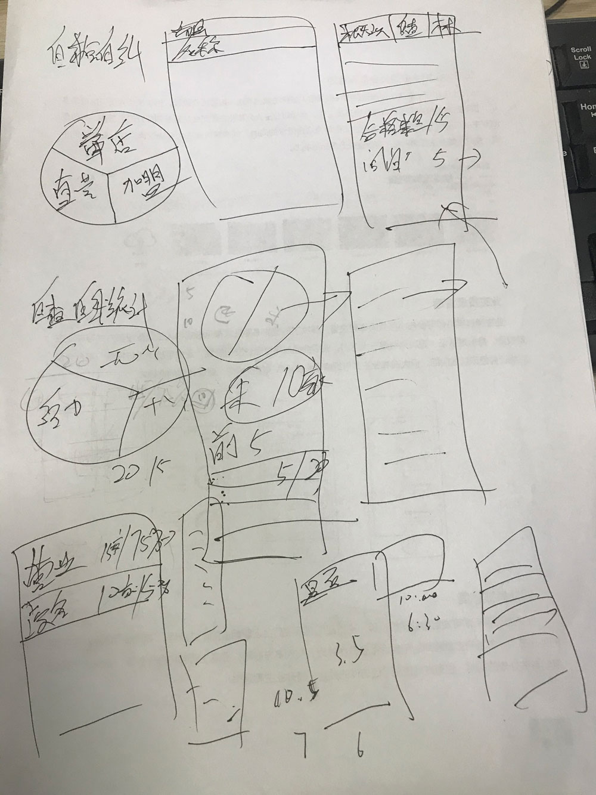
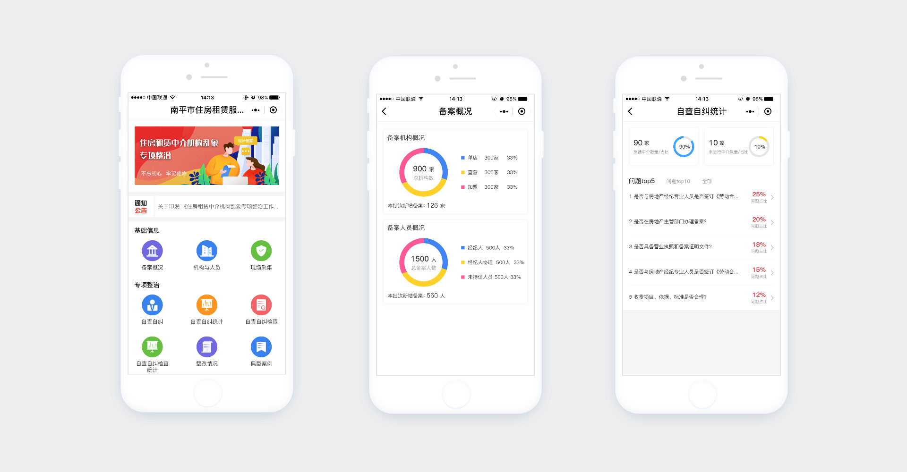
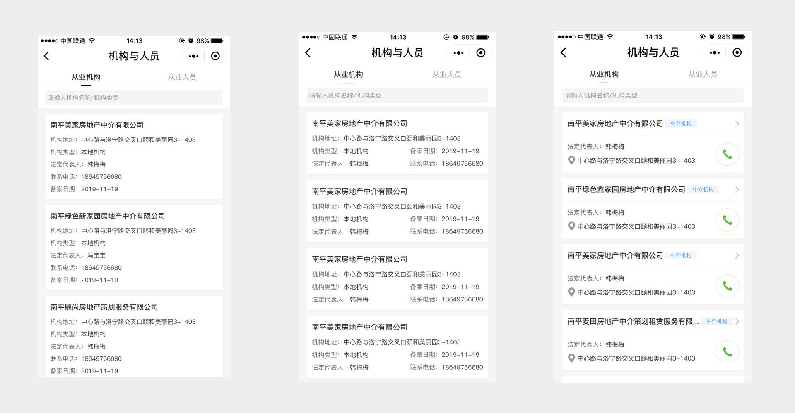
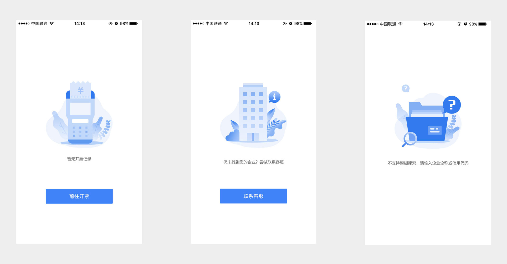
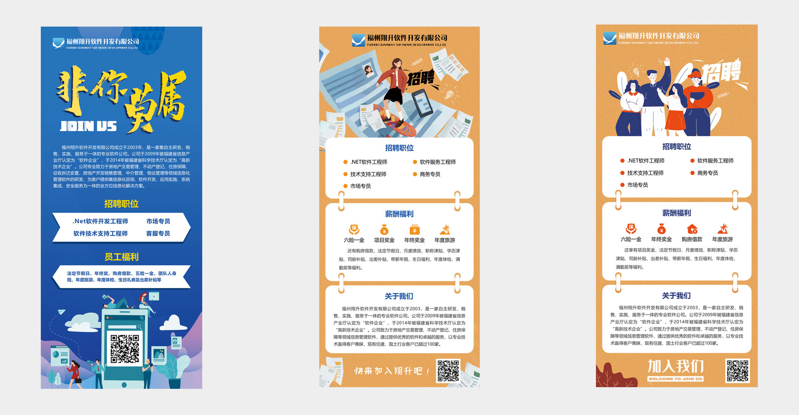

# 十一月份一些设计思考与总结   

## 一、不做没思考的设计机器
1.要深入去理解业务流程和业务逻辑，要有自己的思考，有时候老板提的需求不一定就都是正确的；
2.要确保上游和下游充分的沟通；
 
 
 
 

## 二、充分了解和满足内部客户的需求
综合部提出校园招聘的展架不吸引人的问题。
为什么不吸引人？1.展架太丑不吸引人；2.信息不突出不吸引人
怎么吸引人，如何做出调整？1.校园招聘面对的群体都是学生容易接受新颖的东西。改用活泼的用色代替原先暗色，通过更为活力的插画更能贴近学生群体；2.用卡片的形式增强信息层级关系，绘制图标突出福利待遇。
由此得到一个版本，不满意遭驳回，原因：插画不当。
结果：最后通过沟通，得到第二版
 

