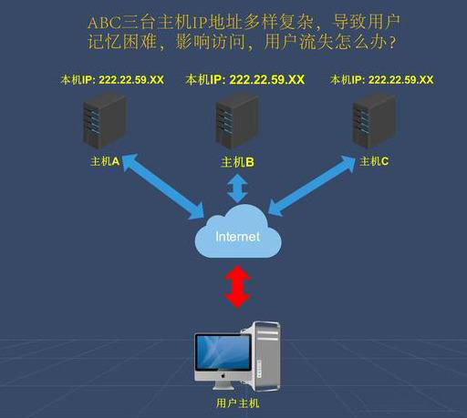

# ip地址、域名、DNS、URL（即网址)的区别与联系 #
**1. ip地址**
IP地址:每个连接到Internet上的主机都会分配一个IP地址，IP地址是用来唯一标识互联网上计算机的逻辑地址，机器之间的访问就是通过IP地址来进行的。IP地址采用二进制的形式表示的话很长，比较麻烦，为了便于使用，IP地址经常被写成十进制的形式，用“.”分开，叫做“点分十进制表示法”,如：127.0.0.1。

**2. 域名**

域名:IP地址毕竟是数字标识，使用时不好记忆和书写，因此在IP地址的基础上又发展出一种符号化的地址方案，来代替数字型的IP地址。每一个符号化的地址都与特定的IP地址对应。这个与网络上的数字型IP地址相对应的字符型地址，就被称为域名。目前域名已经成为互联网品牌、网上商标保护必备的要素之一，除了识别功能外，还有引导、宣传等作用。如：www.fzxs.com.cn

**3. DNS**

DNS，英文全写为Domain Name System，中文意思为域名系统，是互联网中提供域名与IP地址互相映射的分布式数据库。
DNS:在Internet上域名与IP地址之间是一对一（或者多对一）的，域名虽然便于人们记忆，但机器之间只能互相认识IP地址，它们之间的转换工作称为域名解析，域名解析需要由专门的域名解析服务器来完成，DNS就是进行域名解析的服务器。域名的最终指向是IP。

**4. URL**
URL:统一资源定位符（英语UniformResourceLocator的缩写）俗称为网址，网址格式为：<协议>://<域名或IP>:<端口>/<路径>。<协议>://<域名或IP>是必需的，<端口>/<路径>有时可省略。如：https://www.baidu.com/。