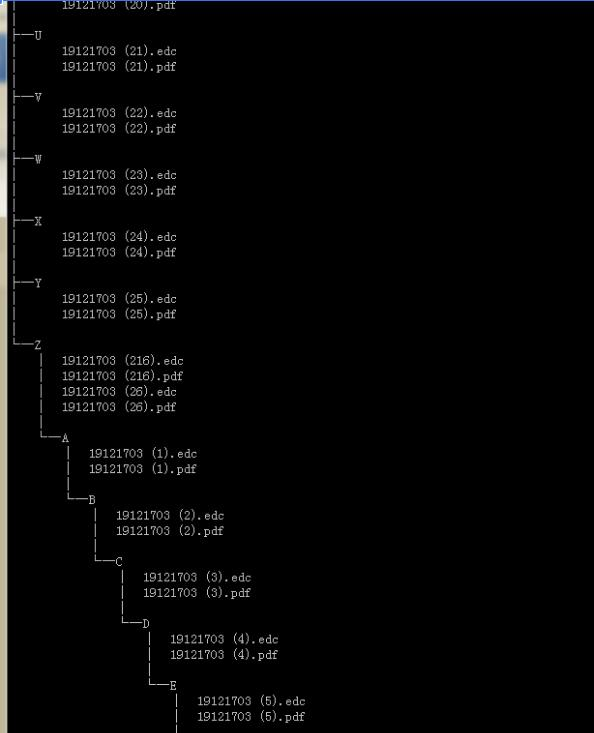
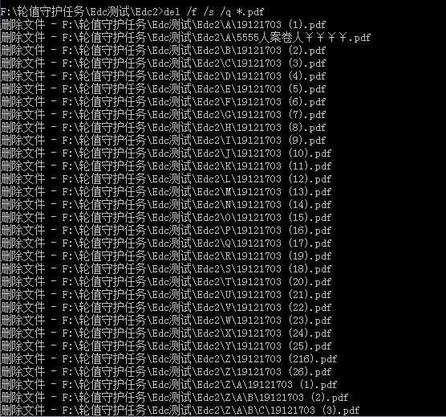

1、tree  /f                    //以树结构方式显示目录下的所有文件夹及文件
/f 显示每个文件中文件的名称
/a 使用ASCII字符，而不使用扩展字符

2、del /f /s /q *.pdf       //删除指定目录下的指定文件（包含子目录中的文件）
/P 删除每一个文件之前提示确认。 

/F 强制删除只读文件。 

/S 从所有子目录删除指定文件。 

/Q 安静模式。删除全局通配符时，不要求确认。 

/A 根据属性选择要删除的文件。

