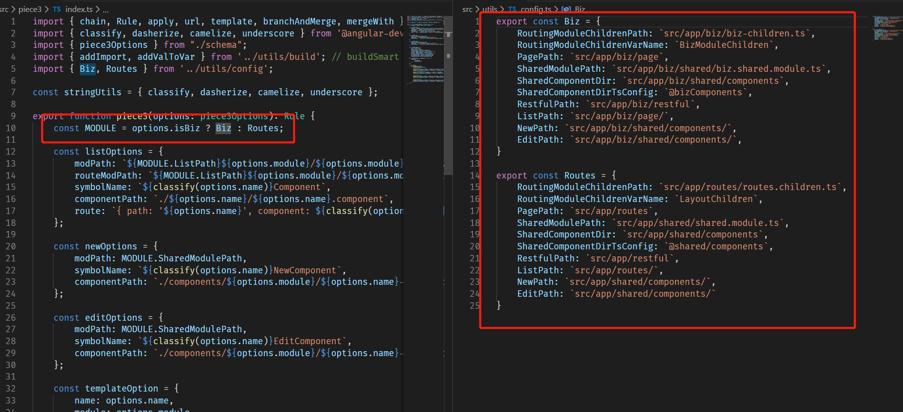
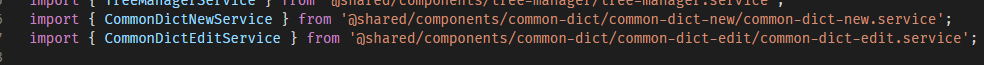

# 一个能提高逼格字体 Fira Code

### 安装 Fira Code


访问此网站 https://github.com/tonsky/FiraCode
找到 Download 这个链接，单击它。


# gitbook 不能有连续的{{}}

否则会报

```
Template render error: 
(.............................................)
  expected variable end
```
具体原因的issue已经是404了。


# Angular项目更好的目录结构
必读：[Angular官方风格指南](https://angular.cn/guide/styleguide#lift)

目前风格指南大多遵循的蛮好，但是只有一个地方是非常糟糕的，就是应用程序结构上。

官方有一个原则
[LIFT](https://angular.cn/guide/styleguide#lift)


* 快速定位 (Locate) 代码
* 一眼识别 (Identify) 代码
* 尽量保持扁平结构 (Flattest) 
* 尝试 (Try) 遵循 DRY (Do Not Repeat Yourself)

**检查应用结构是否合理的方法是问问自己：我能快速打开与此特性（业务）相关的所有文件并开始工作吗？**

我们现在应用结构是完全不行的。现在的应用结构非常烂。

都是通用字典模块但是隔得距离非常远，


那么现在如果我们要找一个文件
* 要么ctrl+p
* 要么滚轮一直滚
* 要么找到列表页然后f12进去


**而且还会影响代码模板生成工具的开发。**

我们的框架分为了业务模块和框架模块，所以一般和列表页在一起的新增和编辑页在的位置也是不同的。那么我这里就要维护两套配置，一套是在routes即框架模块里生成的，一套是biz即业务模块里生成的，这样维护起来非常的蛋疼，一个不小心出错了，生成的就会有问题。




后面阅读了[Angular官方风格指南(偏细节)](https://angular.cn/guide/styleguide#lift)以及[如何定义扩展性良好的Angular项目结构(偏整体，大致和ng-alain相同)](https://itnext.io/choosing-a-highly-scalable-folder-structure-in-angular-d987de65ec7)

整理出来了一组会更好的目录结构

像下面这种，列表页都可以放在平级，然后其相关的新增、编辑或者是详情页都放在列表的子目录下，同时原先的restful文件也都移进来改用service。同时SharedModule存放指令、管道和不与应用程序的其余部分有任何部分依赖关系的组件，然后用一个module统一在SharedModule里导入导出。这样SharedModule也会非常干净。


而且在代码模板生成的时候也不用管是在routes(框架)还是在biz(业务)里，都直接用一个相对路径 ./就可以了，维护起来就不会那么麻烦了。

旧

新


可参考的的项目，ng-zorro成员之一的@hsuanxyz的项目

[zeppelin-frontend-next](https://github.com/zeppelin-next/zeppelin-frontend-next)

