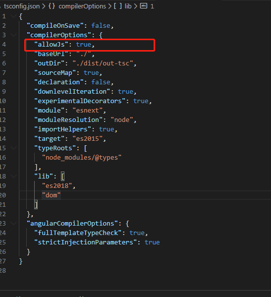
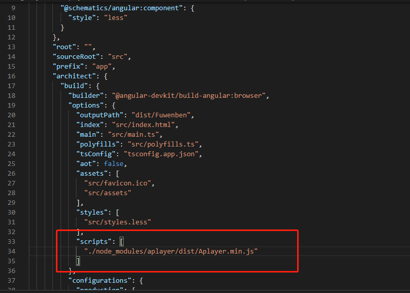

# 1 如何在TypeScript中使用第三方JavaScript框架?

## 1.1 按需引入，在需要的位置引入

``` typescript
import * as (对象名) from '路径';//在引入时给它取一个别名
```

## 1.2 全局引入

在tsconfig.json中配置allowJs：true;



在angular.json中添加script路径



在引入的js包下写一个类型定义文件 xxx.d.ts

``` typescript
declare var xxx:any;
```


# 2、下载youtube视频

https://www.y2b.xyz/